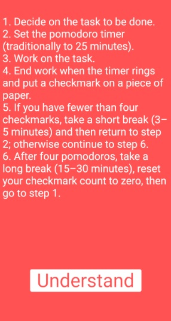

# Pomodoro Technique 

The Pomodoro Technique is a productivity system that stops you from procrastinating or getting distracted, so you can focus on getting stuff done. The idea is simple: set a timer for 25 minutes, work until it runs out, then take a 5-minute break—and repeat the process three more times. After that, take a 15- to 30-minute break. That's one full Pomodoro cycle. 

Despite how basic it sounds, the Pomodoro Technique is incredibly effective. I'm using it right now to write this intro. The 25-minute work session is long enough that you can stay fully engaged, while the 5-minute breaks, which are never too far off, give you a chance to check Twitter or your email without disrupting your work. 

While you can use any timer (or timer app) you want, a dedicated Pomodoro app can make your life a little easier by automatically alternating between work and break periods. It saves you the hassle of winding up a manual timer or constantly checking the clock. So, let's have a look at the best Pomodoro timers.

# Pomodoro Timer

